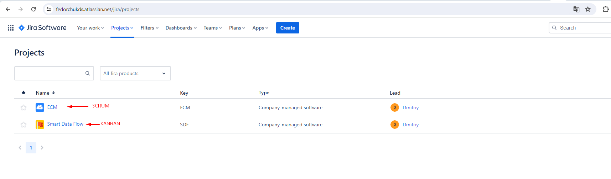
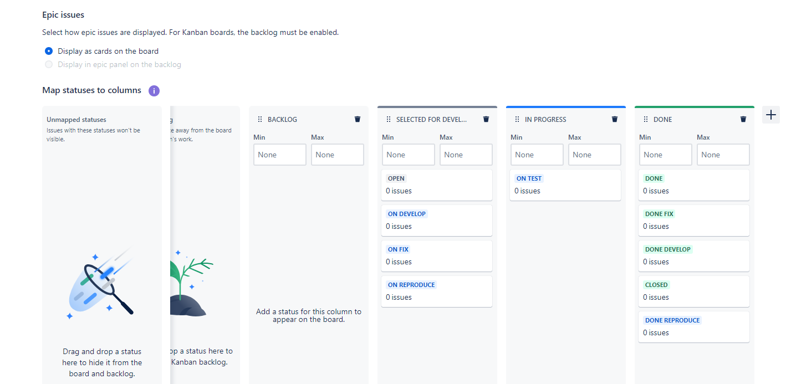
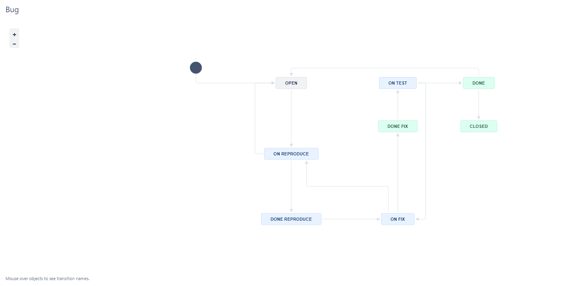
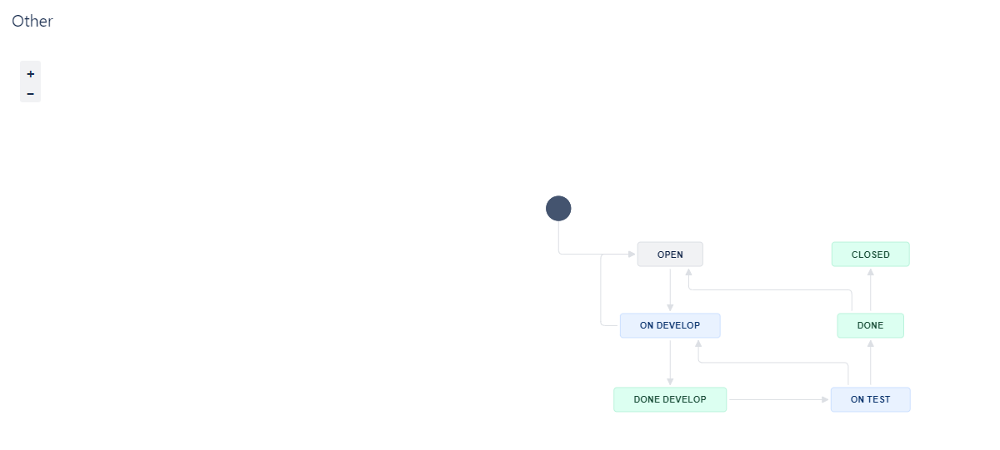

# Автор: Федорчук Дмитрий Сергеевич DEVOPS-33

# Домашнее задание к занятию «Жизненный цикл ПО»

## Подготовка к выполнению
1. Используя VPN получил бесплатную версию Jira, создал аккаунт.
2. Создал доски Kanban и Scrum:

## Решение основной части

Создал статусы для доски Kanban:

Создаю два Workflows согласно заданию:

Workflow для типов задач Bug:

Workflow для всех остальных типов задач:

